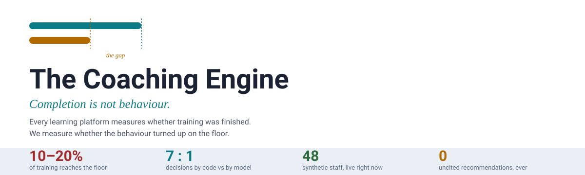
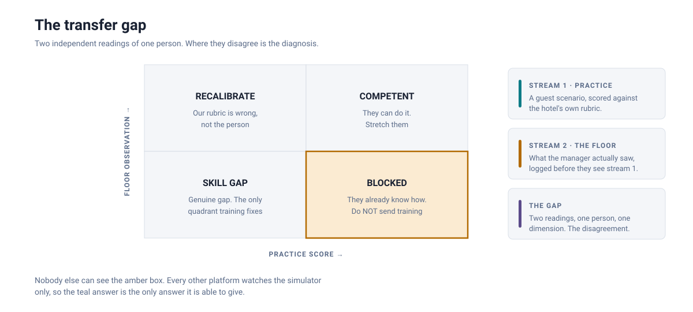
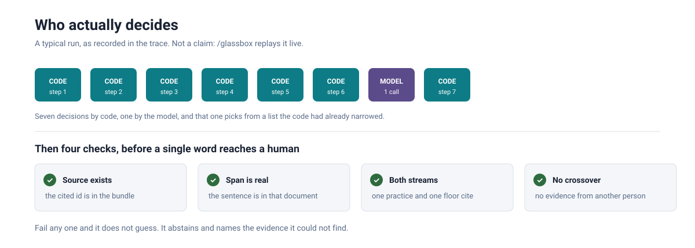
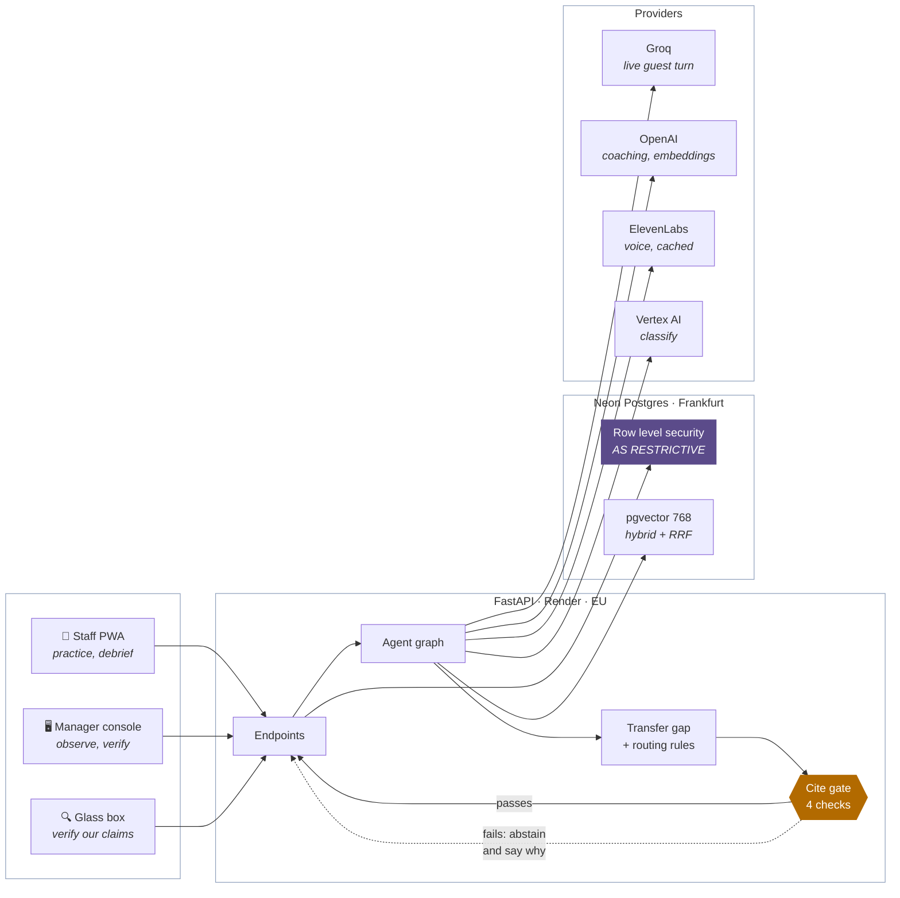

<div align="center">

<picture>
  <source media="(prefers-color-scheme: dark)" srcset="docs-assets/readme/banner-dark.svg">
  <source media="(prefers-color-scheme: light)" srcset="docs-assets/readme/banner-light.svg">
  
</picture>

<br>

  -5B4B8A?style=for-the-badge) 

**[▶ Open the live system](https://naic-2026-coaching-engine.vercel.app)** &nbsp;·&nbsp; **[🔍 Verify our claims](https://naic-2026-coaching-engine.vercel.app/glassbox)** &nbsp;·&nbsp; **[📊 Progress](PROGRESS.md)** &nbsp;·&nbsp; **[🔌 API guide](API-INTEGRATION.md)** &nbsp;·&nbsp; **[📸 Screenshots](docs-assets/walkthrough)**

<sub>TechIreland National AI Challenge 2026 · Challenge 09, hospitality and retail workforce operations · Hub: Dogpatch Labs, Dublin</sub>

</div>

---

> **Every learning platform in the world measures training completion.**
> Nobody measures whether the behaviour actually showed up on the floor. We watch the same
> person from two independent angles and treat **the gap between them** as the product.

---

## ⚠️ Read this before your first commit

> [!CAUTION]
> **This repository is PUBLIC.** Anything you push is world-readable, permanently, including in
> the git history after you delete it. Assume a competing team can read every commit.

| Rule | Why it is absolute |
|---|---|
| **Never commit the hotel SOPs** | `Docs/SOPs/` in the shared drive is a real property's internal operations manuals, shared with Mary-Susan for prototype use only. Somebody else's confidential material, not ours to publish. `.gitignore` blocks them. Do not work around it |
| **Never commit real staff data** | Synthetic personas only, everywhere. We are pitching governance. Being casual here would be indefensible |
| **Never commit secrets** | No API keys, no service-account JSON, no `.env`. Use `.env.example` for the shape and share values another way |

---

## What it actually does

<picture>
  <source media="(prefers-color-scheme: dark)" srcset="docs-assets/readme/transfer-gap-dark.svg">
  <source media="(prefers-color-scheme: light)" srcset="docs-assets/readme/transfer-gap-light.svg">
  
</picture>

A staff member practises a difficult guest. That gives one number. Their manager logs what they
actually saw on shift, **before** they are allowed to see the practice score. That gives a second,
independent number. Two numbers about one person on one dimension is not twice as much data. It is
a different kind of data, because now the two can disagree.

The quadrant that matters is amber. Somebody who performs well in practice and badly on the floor
already knows how. Something in the building is stopping them, and sending them on a course is
worse than doing nothing: it costs money and it costs the last of their belief that anyone is
listening.

> The sequencing is not a UI nicety. `GET /staff/{id}/scores` returns **409** to a manager who has
> not logged their own observation yet. Measurement validity and psychological safety, enforced
> where a bug cannot route around it.

---

## "Isn't this just a wrapper around an LLM?"

<picture>
  <source media="(prefers-color-scheme: dark)" srcset="docs-assets/readme/who-decides-dark.svg">
  <source media="(prefers-color-scheme: light)" srcset="docs-assets/readme/who-decides-light.svg">
  
</picture>

Fair question, and the reason `/glassbox` exists. Three panels, each calling **production code
live** rather than replaying a script:

<table>
<tr>
<td width="33%" valign="top">

### 1 · Run the agent
Watch every step declare who made it. Seven by code, one by the model, and that one picked from
an enum code had already narrowed. When the model cites a span a standard does not contain, you
watch the gate reject it and the model redraft. **That repair loop is the most persuasive thing
in the demo and it happens unprompted.**

</td>
<td width="33%" valign="top">

### 2 · Try to get a lie past
Five handcrafted claims through the same `run_gate()` the agent calls. Each probe isolates
exactly one rule, because a probe that trips two rules proves nothing about which one caught it.

</td>
<td width="33%" valign="top">

### 3 · Ask as three people
Identical SQL, three actors. The colleague reads nothing, the observing manager reads both
streams, L&D reads no individual practice scores. The filtering is in **Postgres**, so a bug in
our API cannot return a row the policy forbids.

</td>
</tr>
</table>

---

## How it fits together



**Deterministic where it must be, model where it adds value.** Escalation thresholds, BARS
anchors, routing rules and audit logging are code: same input, same output, explainable to a works
council. Synthesis, conversation and scenario generation are the model. Both sides share one 1 to 5
scale, so the rules engine and the model can never contradict each other in front of a manager.

---

## Getting started

You need **Docker Desktop running**, Python 3.11+, and pnpm.

```bash
git clone https://github.com/IronNathanAlvares/naic-2026-coaching-engine.git
cd naic-2026-coaching-engine
cp .env.example .env          # then add at least OPENAI_API_KEY
python scripts/bootstrap.py --coach
```

That one command starts Postgres, applies the schema and migrations, seeds the synthetic corpus,
**embeds the standards**, checks every AI provider, and fills the verify queue. It is idempotent,
so run it as often as you like. Add `--reset` to destroy the database and start clean.

Then two terminals:

```bash
cd services/api && python -m uvicorn app.main:app --reload --port 8000
cd web && pnpm install && pnpm dev
```

| | Local | Live |
|---|---|---|
| Manager console | <http://localhost:3000/manager> | [naic-2026-coaching-engine.vercel.app/manager](https://naic-2026-coaching-engine.vercel.app/manager) |
| Staff app | <http://localhost:3000/staff> | [/staff](https://naic-2026-coaching-engine.vercel.app/staff) |
| **Glass box** | <http://localhost:3000/glassbox> | [/glassbox](https://naic-2026-coaching-engine.vercel.app/glassbox) |
| API health | <http://localhost:8000/health> | [/health](https://coaching-engine-api.onrender.com/health) |

---

## Before you demo

Run these three, in this order. About a minute together.

```bash
cd services/agent && python -m pytest -q     # 75 tests, the reasoning
python db/test_rls.py                        # 10 negative tests, the isolation
python tests/test_e2e.py                     # 15 checks, the whole system
```

And one more that costs nothing and needs no database, because a site that breaks on a phone is
a bug like any other:

```bash
python scripts/responsive_audit.py                        # local build on :3100
python scripts/responsive_audit.py https://naic-2026-coaching-engine.vercel.app
```

It drives all ten screens at 360, 768 and 1280 and fails on content wider than the viewport, tap
targets under 36px, or any screen with no way back. It exits non-zero, so it can gate a deploy.

`tests/test_e2e.py --skip-ai` skips anything that spends tokens. That is the one to run in a loop
while you are working.

> [!WARNING]
> **The failure that does not look like a failure.** If the SOP chunks have no embeddings, hybrid
> search returns nothing, the agent cannot ground a single claim, and it abstains on every person
> with a reason that reads like good judgement. Every page still answers `200`. `/health` reports
> `search_index` and the e2e suite asserts it, precisely because this one is otherwise invisible.
> `scripts/bootstrap.py` backfills it.

> [!TIP]
> The API sleeps after 15 idle minutes on the free tier and the first request back takes about 50
> seconds. **Open `/health` a minute before you present anything.** And do not push code on the
> day: a push restarts the service for about three minutes.

<details>
<summary><b>🤖 AI providers, and what each one actually costs</b></summary>

<br>

`python services/api/check_providers.py` calls every provider for real and prints what each one
does. Run it before a demo: *"the key is set"* has never meant *"the call works"* on this project.

| Task | Provider | Why this one |
|---|---|---|
| Guest turn in practice | Groq `qwen3.8-27b` | ~700ms vs ~1400ms. The only task a human waits on live |
| Debrief transcription | Groq `whisper-large-v3-turbo` | Audio is transcribed then deleted |
| Guest voice | ElevenLabs | Cached on disk. Free tier is 10,000 characters for the life of the account |
| Coaching, scoring, embeddings | OpenAI | Latency buys nothing behind a spinner |
| Classification | Vertex AI `gemini-2.5-flash-lite` | Google credits, and the trace records `served_by` |
| Weekly operations brief | Manus | k-anonymised aggregates only |

### What it costs

Measured, not estimated. `/health` reports the running total and the trace carries a per-call figure.

| | |
|---|---|
| One agent run (classify + draft) | **$0.005** |
| Same run when the cite gate forces a repair | $0.010 |
| Whole team, 13 staff (`bootstrap --coach`) | $0.07 |
| Full end-to-end suite, 17 calls | **$0.02** |

`CE_DAILY_USD_LIMIT` (default $5) is a runaway-loop stop, not a budget. At these numbers it is
thousands of recommendations.

**OpenAI is not the resource to ration. ElevenLabs is.** The free tier is 10,000 characters for the
LIFE of the account with no way to buy more, and a guest line is about 120 characters. Synthesis
stops while `CE_VOICE_RESERVE` (default 1,200) characters remain, so the pitch always has voice.
Cached lines still play, which is why the warmed demo lines are committed into the image.

Free commands: `pytest`, `test_rls.py`, `test_e2e.py --skip-ai`, `evals/redteam`,
`evals/retrieval` (without `--ragas`).

If a provider fails, `FALLBACKS` carries the task elsewhere **and records the switch in the trace**.
A demo that silently swaps models is telling you something untrue about what you just saw.

</details>

<details>
<summary><b>📅 Deadlines</b></summary>

<br>

| Date | What |
|---|---|
| Mon 8 Sept | Feature freeze. Nothing new starts after this |
| Fri 11 Sept, 18:00 | **Code freeze.** Only demo-breaking bugs after this |
| Sat 12 Sept | Rehearsal day. Fallback demo video recorded |
| **Sun 13 Sept, 14:00** | **SUBMISSION.** Slides (Google Slides or PowerPoint, **not PDF**) + demo link to Emily@TechIreland.org |
| Mon 14 Sept | Dogpatch Labs. Registration 10:00, pitch 14:00 to 15:00. 7 min pitch + 3 min Q&A |

**The real deadline is the 13th, not the 14th.** Teams that miss it are not permitted to pitch.

</details>

<details>
<summary><b>👥 Who owns what</b></summary>

<br>

| Person | Lane | Directories |
|---|---|---|
| **Mary-Susan McLoughlin** | Team lead, domain | BARS rubric, golden-set ground truth, scope |
| **Nathan Alvares** | Backend AI | `services/agent`, retrieval, calibration, `data-generation` |
| **Ziyi Yan** | Full-stack | `services/api`, `web/`, `db/`, deployment, n8n |
| **Thapelo Khantsi** | Data science | Scoring engine, rules engine, cohort routing |
| **Puneet Warathe** | AI/ML + QA | Session service, model routing, tests |
| **Riyazul Mohamed** | Commercial | Finance model, pricing, competitors |
| **Ievgeniia Pedko** | Product / BA | Journeys, acceptance criteria, transparency copy |

**As of 10 Sept the table above is a statement of lanes, not of who typed what.** Ziyi built the
whole of `web/`. Nathan built `db/`, `services/api` and `services/agent` on top of it, and
consolidated the backend so it would be finished before the freeze. If you are picking something
up, the directory READMEs are more current than this table.

</details>

<details>
<summary><b>📁 Repository layout</b></summary>

<br>

```
contracts/        API contract. Frozen: see CONTRIBUTING before changing
db/
  schema.sql      22 tables. The canonical schema for a FRESH database
  policies.sql    Row level security. The most important file in the repo
  roles.sql       ce_app, the role the API connects as
  migrations/     For databases that are already running
  seed.py         Loads the generated corpus
  test_rls.py     Ten negative tests. They must all pass
services/
  agent/          The tested deterministic core: transfer gap, cite gate,
                  calibration, routing. 75 unit tests, no I/O, no model calls
  api/            FastAPI. Every endpoint, the agent graph, the providers
web/              Next.js. Manager console, staff PWA, and /glassbox
scripts/          bootstrap.py, deploy_db.py, walkthrough.py,
                  responsive_audit.py, gen_readme_art.py
tests/            test_e2e.py, the whole system over HTTP
evals/            redteam attack suite, retrieval evaluation
data-generation/  Deterministic synthetic dataset, 48 staff
docs-assets/      Walkthrough screenshots and this README's artwork
```

Each directory has its own README explaining what belongs there. The LaTeX documents live in the
shared drive, not here: see [CONTRIBUTING.md](CONTRIBUTING.md) for why.

</details>

---

## Governance, on purpose

What this builds is **high-risk AI under EU AI Act Annex III 4(b)**: systems used to evaluate the
performance and behaviour of people in a work relationship. We say so ourselves rather than waiting
to be told.

| Obligation | Where it lives in the code |
|---|---|
| Art. 14 · human oversight | The Verify step. No coaching action on model output alone, no timeout, no auto-approve |
| Art. 13 · transparency | Every recommendation cites its evidence, and staff see every screen a manager sees about them |
| Art. 12 · logging | Append-only audit record |
| Art. 10 · data governance | Per-property isolation in `db/policies.sql`, EU hosting, no biometrics |
| Art. 15 · accuracy | The calibration score, Wilson interval, reported including where we are weak |
| Art. 9 · risk management | Root-cause routing, so an organisational failure is not filed against a person |

> [!IMPORTANT]
> **Annex III 4(c) is the line we will not cross.** Real-time monitoring of workers' emotional or
> behavioural state is a heavier legal category and it is not the product. We never listen to live
> guest interactions and never infer emotional state in real time. Consented practice sessions and
> human-logged observations only.

---

## Three things we never cut

Under time pressure we cut scope in the order set out in `05-Sprint-Plan` §3.3. These three are
not on that list:

<table>
<tr>
<td width="33%" valign="top"><b>🚧 The cite gate</b><br><sub>including its abstain path. If it cannot cite the turn, the observation and the clause, it says nothing</sub></td>
<td width="33%" valign="top"><b>✋ The verify interrupt</b><br><sub>no coaching action on AI output alone, no timeout, no auto-approve</sub></td>
<td width="33%" valign="top"><b>📏 The calibration number</b><br><sub>the system reports its own accuracy, including where it is weak</sub></td>
</tr>
</table>

Those three are the product.

---

<div align="center">
<sub>

**[PROGRESS.md](PROGRESS.md)** · what is done, what is left, and what is not real &nbsp;&nbsp;|&nbsp;&nbsp; **[API-INTEGRATION.md](API-INTEGRATION.md)** · how the frontend talks to the backend &nbsp;&nbsp;|&nbsp;&nbsp; **[CONTRIBUTING.md](CONTRIBUTING.md)** · what goes in this repo and what does not

<br>

The 25 LaTeX documents (HLD, LLD, PDD, finance model, competitive landscape, the 22-page
product walkthrough) live in the team's shared drive, not in this repository.
See [CONTRIBUTING.md](CONTRIBUTING.md) for why.

<br>

*Completion is not behaviour. We measure what happened next.*

</sub>
</div>
